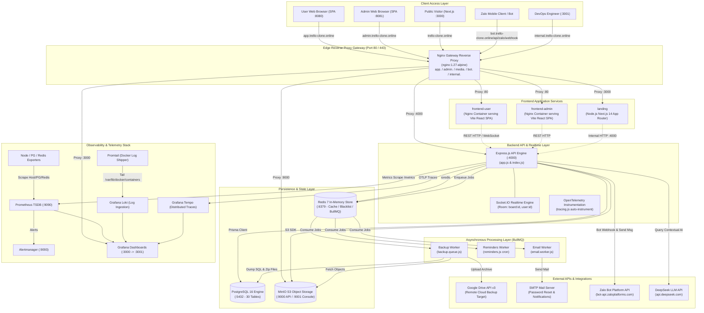
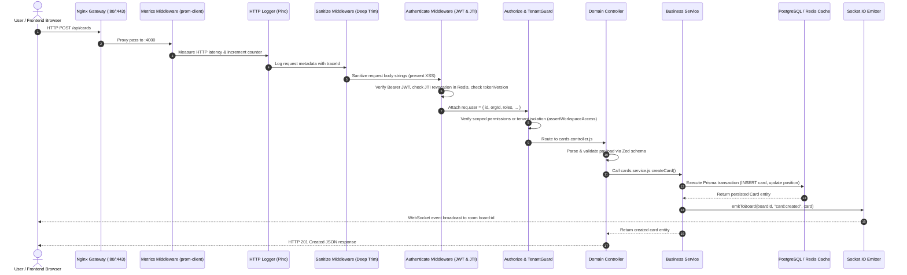
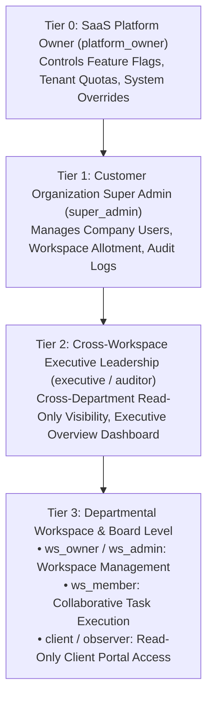
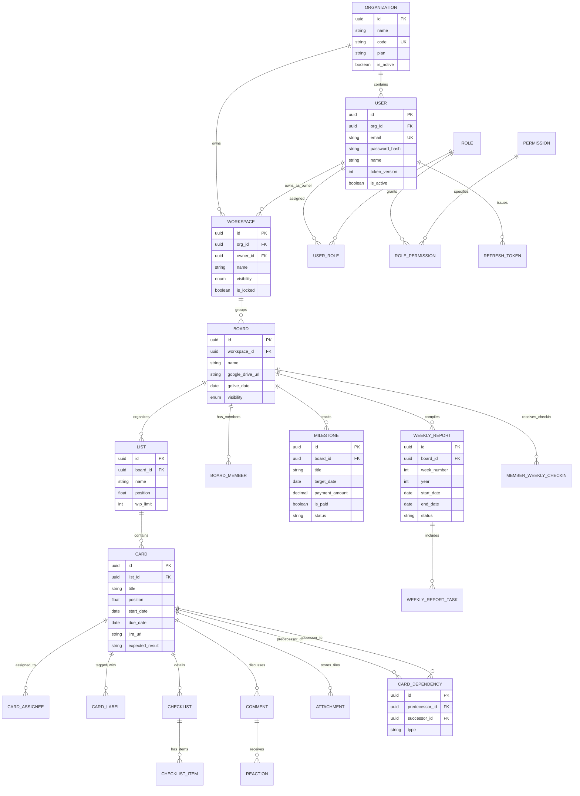
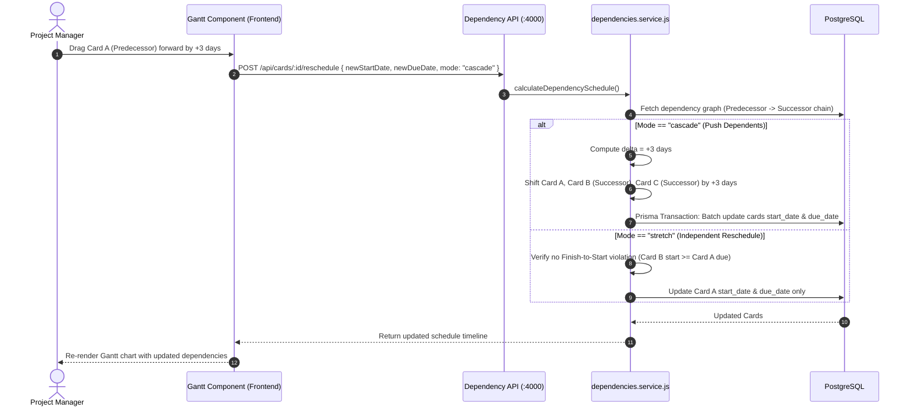
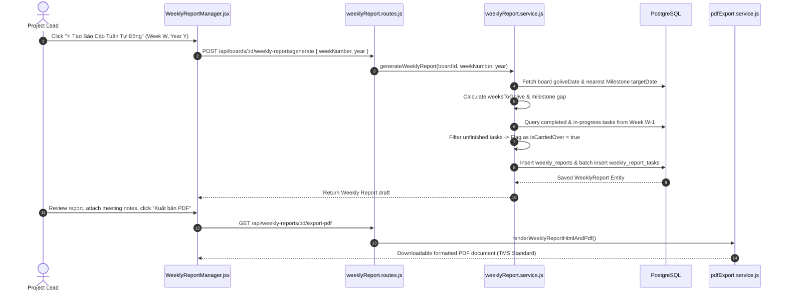
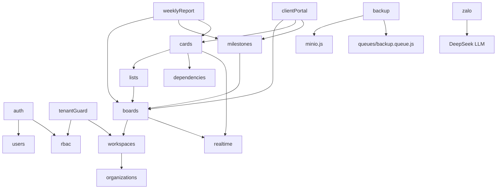
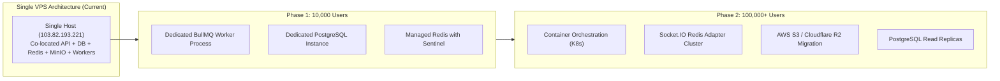
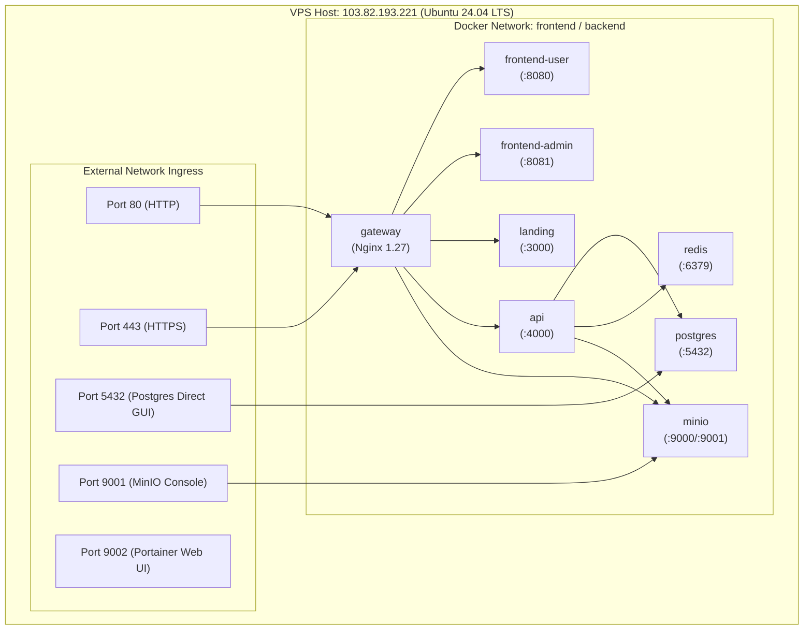

# System Architecture Document — Trello Clone Enterprise B2B SaaS

> **Official Project Architecture Document**  
> **Repository:** `Class-Trello-Clone`  
> **Architect Role:** Principal Software Architect  
> **Generation Date:** 2026-09-24  
> **Compliance:** Strict Codebase Grounding (`file:line`), Zero Fabrication Protocol

---

## Table of Contents

1. [Project Overview](#1-project-overview)
2. [Tech Stack](#2-tech-stack)
3. [Folder Structure](#3-folder-structure)
4. [System Architecture](#4-system-architecture)
5. [Module Breakdown](#5-module-breakdown)
6. [Request Flow](#6-request-flow)
7. [Authentication](#7-authentication)
8. [Authorization](#8-authorization)
9. [Database Architecture & Data Models](#9-database-architecture--data-models)
10. [API Architecture](#10-api-architecture)
11. [Business Flow](#11-business-flow)
12. [Dependency Graph](#12-dependency-graph)
13. [External Services](#13-external-services)
14. [Configuration](#14-configuration)
15. [Logging](#15-logging)
16. [Error Handling](#16-error-handling)
17. [Security Architecture](#17-security-architecture)
18. [Performance & Optimization](#18-performance--optimization)
19. [Scalability Analysis](#19-scalability-analysis)
20. [Deployment Architecture](#20-deployment-architecture)
21. [Testing Strategy](#21-testing-strategy)
22. [Coding Conventions](#22-coding-conventions)
23. [Design Patterns Detected](#23-design-patterns-detected)
24. [System Strengths](#24-system-strengths)
25. [Technical Debt](#25-technical-debt)
26. [Improvement Proposals](#26-improvement-proposals)
27. [Appendix (Consolidated Diagrams)](#27-appendix-consolidated-diagrams)

---

## 1. Project Overview

### 1.1 Business Domain & Functional Scope
The **Trello Clone Enterprise B2B SaaS** system is a self-hosted, multi-tenant project management, task collaboration, and enterprise progress tracking platform. It merges traditional Kanban drag-and-drop workflows with B2B Enterprise delivery capabilities:
- **Hierarchical Tenancy:** Platform Owner $\rightarrow$ Customer Organizations $\rightarrow$ Cross-Workspace Executive Leadership $\rightarrow$ Departmental Workspaces $\rightarrow$ Boards $\rightarrow$ Lists $\rightarrow$ Cards.
- **Enterprise Project Delivery:** Interactive Gantt charts with Finish-to-Start (FS) and Start-to-Start (SS) dependency chains, Milestone revenue tracking gates, multi-assignee assignment (Internal Project In-Charge [Smartlog PIC] vs Client In-Charge [Foodlog PIC]), Jira integration, and automated Weekly Report generation with carried-over tasks.
- **Client Transparency:** Dedicated read-only Client Portal interface for external stakeholders.
- **Operational Resilience:** Automated dual-target backup (PostgreSQL + MinIO object storage to local snapshots and Google Drive), integrated AI chatbot assistant via Zalo webhook with DeepSeek LLM, and full-stack observability.

### 1.2 System Architecture Paradigm
- **Backend:** Layered Modular Monolith built on Node.js (ESM) and Express 4.21, utilizing Prisma ORM 5.22, Redis 7 caching, Socket.IO 4.8 realtime engine, and BullMQ 5.78 asynchronous job workers (`Trello-Clone-Backend/src/index.js:1-37`).
- **Frontend:** Multi-application workspace monorepo managing three distinct web client applications and a shared component/token package (`Trello-Clone-Frontend/package.json:5-8`):
  1. `@trello/user`: React 18 + Vite SPA for end-user collaboration, Kanban, Gantt, and Weekly Reports.
  2. `@trello/admin`: React 18 + Vite SPA for Super Admin and Platform Owner system controls, audit logs, and backups.
  3. `@trello/landing`: Next.js 14 App Router application for marketing, public showcase, and SEO.
  4. `@trello/ui`: Shared UI component primitives, design tokens, permission hooks, and Axios API abstraction.
- **Infrastructure:** Docker Compose orchestrated micro-infra with Nginx 1.27 edge reverse proxy gateway, PostgreSQL 16 Alpine, Redis 7 Alpine, MinIO Object Storage, Portainer CE, and a comprehensive Prometheus/Grafana/Loki/Tempo observability stack (`Trello-Clone-Infra/docker-compose.yml:1-170`).

---

## 2. Tech Stack

| Layer | Component | Version / Library | Source Reference |
| :--- | :--- | :--- | :--- |
| **Backend Runtime** | Node.js (ESM native) | `>= 20.0.0` | `Trello-Clone-Backend/package.json:47` |
| **Backend Framework** | Express | `^4.21.2` | `Trello-Clone-Backend/package.json:30` |
| **ORM / Data Access** | Prisma ORM | `^5.22.0` | `Trello-Clone-Backend/package.json:25` |
| **Database** | PostgreSQL | `16-alpine` | `Trello-Clone-Infra/docker-compose.yml:5` |
| **In-Memory Cache** | Redis / ioredis | Redis `7-alpine` / `ioredis ^5.4.2` | `Trello-Clone-Backend/package.json:32` |
| **Job Queue Engine** | BullMQ | `^5.78.0` | `Trello-Clone-Backend/package.json:27` |
| **Realtime Engine** | Socket.IO | `^4.8.3` | `Trello-Clone-Backend/package.json:39` |
| **Object Storage** | MinIO Client / Server | `minio ^8.0.2` (S3 API compliant) | `Trello-Clone-Backend/package.json:34` |
| **Authentication** | JWT & Bcrypt | `jsonwebtoken ^9.0.2`, `bcryptjs ^2.4.3` | `Trello-Clone-Backend/package.json:26,33` |
| **Validation** | Zod | `^3.24.1` | `Trello-Clone-Backend/package.json:41` |
| **Observability (Tracing)** | OpenTelemetry Node SDK | `@opentelemetry/sdk-node ^0.219.0` | `Trello-Clone-Backend/package.json:23` |
| **Observability (Metrics)** | Prometheus client | `prom-client ^15.1.3` | `Trello-Clone-Backend/package.json:38` |
| **Observability (Logging)** | Pino & Pino-HTTP | `pino ^10.3.1`, `pino-http ^11.0.0` | `Trello-Clone-Backend/package.json:36-37` |
| **Email Service** | Nodemailer | `^8.0.10` | `Trello-Clone-Backend/package.json:35` |
| **External APIs** | Google APIs, Zalo, DeepSeek | `googleapis ^144.0.0`, native `fetch` | `Trello-Clone-Backend/package.json:31` |
| **Frontend - User App** | React 18, Vite, dnd-kit | React `^18.3.1`, `@dnd-kit/core ^6.1.0` | `Trello-Clone-Frontend/apps/user/package.json:11-24` |
| **Frontend - Admin App** | React 18, Vite, Lucide | React `^18.3.1`, `lucide-react ^0.456.0` | `Trello-Clone-Frontend/apps/admin/package.json:12-19` |
| **Frontend - Landing** | Next.js App Router | `next 14.2.15`, React `^18.3.1` | `Trello-Clone-Frontend/apps/landing/package.json:10-14` |
| **Frontend - State & Net**| TanStack Query & Axios | `@tanstack/react-query ^5.59.0`, `axios ^1.7.7` | `Trello-Clone-Frontend/apps/user/package.json:15,17` |
| **Edge Gateway** | Nginx Reverse Proxy | `nginx:1.27-alpine` | `Trello-Clone-Infra/docker-compose.yml:100` |
| **Container Engine** | Docker & Docker Compose | Compose file specification | `Trello-Clone-Infra/docker-compose.yml:1` |
| **CI/CD Automation** | GitHub Actions & SSH Action | `appleboy/ssh-action@v1.2.0` | `.github/workflows/deploy.yml:18` |

---

## 3. Folder Structure

```
Class-Trello-Clone/
├── .agents/                        # AI development agent rules, memory, workflows, and skills
│   ├── memory/                     # Persistent session memory (MEMORY.md)
│   ├── rules/                      # System operation rules (core-protocol, request-routing)
│   ├── skills/                     # Domain skills (architecture-plan, clean-code, etc.)
│   └── workflows/                  # Automation slash command runbooks
├── .github/workflows/              # Continuous Integration & Deployment pipelines
│   ├── deploy.yml                  # Production VPS deployment via SSH pull & up
│   ├── docker-publish-backend.yml  # Backend Docker image GHCR publishing
│   └── docker-publish-frontend.yml # Frontend Docker images GHCR publishing
├── docs/                           # Enterprise flow specifications & business artifacts
│   ├── flows/                      # QT-01: Gantt, Milestone, and Weekly Report specification
│   └── W23 - Weekly Report.pptx    # TMS Project baseline presentation reference
├── google-drive-backup/            # Operational runbooks & blueprints for GDrive sync
│   ├── BACKUP-FEATURE-BLUEPRINT.md # Enterprise backup architecture blueprint
│   └── BACKUP-GDRIVE-SETUP.md      # Google Cloud Service Account setup procedure
├── Trello-Clone-Backend/           # Modular Monolith Express API Application
│   ├── prisma/                     # Database ORM definition and migrations
│   │   ├── migrations/             # Tracked SQL migration history
│   │   └── schema.prisma           # 30 relational data models and enums
│   └── src/
│       ├── app.js                  # Express application factory & middleware pipeline
│       ├── index.js                # Server entry point, HTTP server & worker bootstrap
│       ├── config/                 # Environment validation, DB, Redis, MinIO clients
│       ├── db/                     # Database seeders (seed.js)
│       ├── lib/                    # Shared utilities, email templates, custom error classes
│       ├── middleware/             # Auth, RBAC authorize, sanitize, tenantGuard, featureFlags
│       ├── modules/                # 26 business domain modules (Controller-Service-Route)
│       ├── observability/          # OpenTelemetry tracing, Pino logger, Prometheus metrics
│       ├── queues/                 # BullMQ queues & workers (Email, Reminders, Backup)
│       └── realtime/               # Socket.IO connection manager & room emitters
├── Trello-Clone-Frontend/          # Multi-App Frontend Monorepo
│   ├── apps/
│   │   ├── admin/                  # Super Admin Dashboard (Vite + React 18 SPA)
│   │   ├── landing/                # Public Marketing & Showcase (Next.js 14 SSR/SSG)
│   │   └── user/                   # Core Trello User Client (Vite + React 18 SPA)
│   └── packages/
│       └── ui/                     # Shared UI components, tokens, auth state, permissions
├── Trello-Clone-Infra/             # Infrastructure & Deployment Orchestration
│   ├── docker-compose.yml          # Core production multi-container orchestration
│   ├── docker-compose.prod.yml     # Production overrides (prebuilt image tags)
│   ├── docker-compose.monitoring.yml # Prometheus, Grafana, Loki, Tempo, Exporters stack
│   ├── monitoring/                 # Monitoring configs (prometheus.yml, alertmanager, grafana)
│   └── nginx/                      # Edge reverse proxy configs (gateway.conf)
├── CAU_TRUC_PHAN_QUYEN_RBAC_B2B.txt # Canonical 4-Tier B2B RBAC Architecture Specification
├── implementation_plan.md          # Architectural implementation audit record
├── TRELLO_CONNECTIONS.md           # Deployment host connection matrix
└── VPS_INFO.md                     # Host machine infrastructure specification
```

---

## 4. System Architecture

### 4.1 High-Level Architecture Diagram



---

## 5. Module Breakdown

The Express backend organizes business functionality into 26 modular domain folders located under `Trello-Clone-Backend/src/modules/`:

| # | Module | Primary Purpose & Responsibilities | Key File Path | DB Models Touched | Dependencies |
| :--- | :--- | :--- | :--- | :--- | :--- |
| 1 | `auth` | User registration, login, token refresh, multi-device logout, password reset | `modules/auth/` | `User`, `RefreshToken` | `bcryptjs`, `jsonwebtoken`, `redis`, `email.queue` |
| 2 | `users` | User profile retrieval, search, avatar update, password changes | `modules/users/` | `User` | `prisma`, `auth` |
| 3 | `me` | Current authenticated user context, assigned cards, starred boards | `modules/me/` | `User`, `Card`, `BoardStar` | `prisma` |
| 4 | `workspaces` | Departmental workspace CRUD, member invitations, tenant scoped role assignments | `modules/workspaces/` | `Workspace`, `WorkspaceInvite`, `UserRole` | `prisma`, `tenantGuard` |
| 5 | `boards` | Kanban board CRUD, stars, board membership, background styling, templates | `modules/boards/` | `Board`, `BoardMember`, `BoardStar` | `prisma`, `realtime` |
| 6 | `lists` | Kanban column CRUD, fractional position reordering, WIP limits | `modules/lists/` | `List`, `Card` | `prisma`, `position.js`, `realtime` |
| 7 | `cards` | Card lifecycle, moves between lists, due dates, Jira URLs, expected results | `modules/cards/` | `Card`, `CardAssignee`, `CardMember` | `prisma`, `position.js`, `realtime` |
| 8 | `checklists` | Sub-task checklist headers and checklist items with done toggles | `modules/checklists/` | `Checklist`, `ChecklistItem` | `prisma`, `realtime` |
| 9 | `comments` | Threaded discussions on cards, edit history, emoji reactions | `modules/comments/` | `Comment`, `Reaction` | `prisma`, `realtime` |
| 10 | `attachments` | Presigned URL generation and metadata tracking for MinIO object storage | `modules/attachments/` | `Attachment` | `minio.js`, `prisma` |
| 11 | `labels` | Board-scoped tags/labels and associations to cards | `modules/labels/` | `Label`, `CardLabel` | `prisma` |
| 12 | `customFields`| Dynamic schema custom fields (text, number, date, checkbox, dropdown) | `modules/customFields/` | `CustomField`, `CustomFieldValue` | `prisma` |
| 13 | `activity` | Audit log of board and card actions (moves, comments, updates) | `modules/activity/` | `Activity` | `prisma` |
| 14 | `notifications`| In-app notification dispatch and read-state management | `modules/notifications/`| `Notification` | `prisma`, `realtime` |
| 15 | `search` | Global cross-board search for cards and boards | `modules/search/` | `Card`, `Board` | `prisma` |
| 16 | `reactions` | Emoji reactions on cards and comments | `modules/reactions/` | `Reaction` | `prisma`, `realtime` |
| 17 | `rbac` | Role and permission loading, Redis cache management, access auditing | `modules/rbac/` | `Role`, `Permission`, `UserRole`, `AccessAudit`| `redis`, `prisma` |
| 18 | `admin` | Super Admin operations: manage users, inspect storage, trigger migrations | `modules/admin/` | `User`, `Workspace`, `Setting` | `prisma`, `minio.js` |
| 19 | `organizations`| B2B SaaS Organization tenant management, plan quotas, member directories | `modules/organizations/`| `Organization`, `User`, `Workspace` | `prisma`, `rbac` |
| 20 | `milestones` | Delivery milestones with single target dates and financial payment gates | `modules/milestones/` | `Milestone`, `WeeklyReport` | `prisma` |
| 21 | `dependencies`| Finish-to-Start (FS) and Start-to-Start (SS) task dependencies and push logic | `modules/dependencies/`| `CardDependency`, `Card` | `prisma` |
| 22 | `weeklyReport` | TMS Weekly Report generator, task rollover, check-ins, HTML/PDF export | `modules/weeklyReport/`| `WeeklyReport`, `WeeklyReportTask`, `MemberWeeklyCheckin` | `prisma`, `pdfExport.service.js` |
| 23 | `clientPortal` | Sanitized read-only portal for external clients (Kanban, Milestones, Gantt) | `modules/clientPortal/`| `Board`, `Milestone`, `Card` | `prisma` |
| 24 | `backup` | Dual-target backup engine (Postgres pg_dump + MinIO data to Local & GDrive) | `modules/backup/` | `BackupRun`, `Setting` | `backup.queue.js`, `googleapis` |
| 25 | `landing` | Public API endpoints serving marketing statistics and dynamic landing config | `modules/landing/` | `Setting` | `prisma` |
| 26 | `zalo` | Zalo Bot webhook, message routing, and DeepSeek contextual AI integration | `modules/zalo/` | N/A (Stateless) | `fetch`, `env.js` |

---

## 6. Request Flow

### 6.1 End-to-End Pipeline
Every HTTP request traverses a deterministic sequence of middleware layers before reaching domain business logic:



---

## 7. Authentication

### 7.1 Architecture & Token Lifecycle
Authentication is implemented via a dual-token architecture (`Trello-Clone-Backend/src/modules/auth/tokens.js:1-25`):
1. **Access Token:** Short-lived JWT (default `15m`, configured via `ACCESS_TOKEN_TTL`), containing `user_id`, `token_version`, and unique `jti` (UUID). Signed with HS256 using `JWT_SECRET`.
2. **Refresh Token:** Long-lived credential (default `7d`, configured via `REFRESH_TOKEN_TTL_DAYS`). Persisted in the `refresh_tokens` database table with a cryptographically hashed token (`token_hash`), unique `jti`, and user association.
3. **Session Delivery:** Delivered to clients via HTTP response JSON and HTTP-only cookies (`cookie-parser`).

### 7.2 Revocation, Blacklisting, and Global Logout
- **JTI Blacklist:** Upon logout or token rotation, the active token's `jti` is cached in Redis under `revoked_jti:${jti}` with a TTL matching token expiry (`Trello-Clone-Backend/src/middleware/authenticate.js:7,25`).
- **Token Versioning:** The `users` table contains `token_version: Int` (`schema.prisma:21`). Changing passwords or triggering "Log out from all devices" increments `token_version`, which immediately invalidates all outstanding JWTs without waiting for token expiration (`authenticate.js:33-35`).
- **Enterprise UPN Identity:** Users authenticate using standard email or Enterprise Universal Principal Name (UPN) syntax (`username@company_code`), enabling multi-tenant login resolution (`CAU_TRUC_PHAN_QUYEN_RBAC_B2B.txt:180-220`).

---

## 8. Authorization

### 8.1 4-Tier B2B RBAC Model
The platform enforces a 4-tier authorization structure (`CAU_TRUC_PHAN_QUYEN_RBAC_B2B.txt:26-56`, `tenantGuard.js:5-78`):



### 8.2 Permission Resolution & High-Performance Caching
1. **Database Schema:** Defined via `roles`, `permissions`, `role_permissions`, and `user_roles` (`schema.prisma:69-124`).
2. **Tenant Scoping:** Scoped roles (e.g. `ws_owner`, `ws_member`) populate `tenant_id = workspace_id` in `user_roles`. System-wide roles set `tenant_id = NULL`.
3. **Redis Caching:** Permissions are loaded via Prisma and cached in Redis under `perms:${userId}` with a 300-second TTL (`perms.js:4-39`).
4. **Cache Invalidation:** Any role assignment, modification, or revocation triggers `invalidateUserPerms(userId)` or `invalidatePermsForRole(roleId)` (`perms.js:54-67`).
5. **Access Audit:** Sensitive operations (`roles.assign`, `workspaces.lock`, `users.suspend`, `system.impersonate`) trigger immutable audit logging to the `access_audit` table (`authorize.js:8-17,48-56`).

---

## 9. Database Architecture & Data Models

### 9.1 Database Engine & Connection Strategy
- **Engine:** PostgreSQL 16 Alpine running within Docker (`Trello-Clone-Infra/docker-compose.yml:4-20`).
- **Connection Management:** Prisma Client with connection pooling configured via `DATABASE_URL` (`Trello-Clone-Backend/src/config/db.js:1-12`).

### 9.2 Entity-Relationship Diagram (ERD)



### 9.3 Indexing Strategy
- **Foreign Key Indexing:** Every relation is indexed (e.g. `@@index([orgId])`, `@@index([workspaceId])`, `@@index([boardId])`, `@@index([listId])`, `@@index([cardId])`).
- **Temporal Sorting Indexes:** Activity feeds and audit tables use descending timestamp indexes: `@@index([actorId, createdAt(sort: Desc)])` (`schema.prisma:136,486`).
- **Composite Business Keys:** Weekly reports enforce uniqueness with `@@unique([boardId, weekNumber, year])` (`schema.prisma:619`).
- **Fractional Positioning:** `position: Float` on `lists`, `cards`, and `checklists` allows $O(1)$ reordering without updating subsequent rows (`position.js:1-17`).

---

## 10. API Architecture

### 10.1 Conventions & REST Standards
- **Endpoint Structure:** Modular REST APIs mounted under `/api/*` (`Trello-Clone-Backend/src/app.js:63-88`).
- **Data Exchange:** Exclusively `application/json` payload format with a 1MB limit (`app.js:45`).
- **Standard Error Envelope:**
  ```json
  {
    "error": {
      "code": "BAD_REQUEST",
      "message": "Validation failed",
      "details": { ... }
    }
  }
  ```
- **Realtime WebSocket Channels:** Realtime events emitted on `board:${boardId}` and `user:${userId}` (`realtime/index.js:56-79`).

### 10.2 Primary Route Manifest

| Route Prefix | Controller / Router | Description & Access Level |
| :--- | :--- | :--- |
| `GET /health` | Health Check | System liveness, DB & Redis health check (`app.js:55`) |
| `GET /metrics`| Prometheus Handler | System telemetry metrics endpoint (`app.js:42`) |
| `/api/auth` | `auth.routes.js` | Login, registration, token refresh, logout, password reset |
| `/api/workspaces` | `workspaces.routes.js` | Workspace CRUD, members, invites, role assignments |
| `/api/boards` | `boards.routes.js` | Board management, membership, templates, stars |
| `/api/lists` | `lists.routes.js` | Kanban columns, position adjustments, WIP limits |
| `/api/cards` | `cards.routes.js` | Card operations, moves, due dates, Jira links |
| `/api/milestones` | `milestones.routes.js` | Delivery milestones and payment gate management |
| `/api/dependencies`| `dependencies.routes.js`| Finish-to-Start dependency management & cascade push |
| `/api/weekly-report`| `weeklyReport.routes.js`| Weekly Report generation, task rollover, PDF exports |
| `/api/client-portal`| `clientPortal.routes.js`| External customer sanitized read-only endpoints |
| `/api/admin` | `admin.routes.js` | Super Admin operations, user management, system configs |
| `/api/admin/backup` | `backup.routes.js` | Automated & manual backup trigger, restore, Google Drive |
| `/api/zalo` | `zalo.routes.js` | Zalo Bot webhook receiver and DeepSeek AI router |

---

## 11. Business Flow

### 11.1 Gantt Dependency Scheduling (Cascade Push vs Flexible Stretch)



### 11.2 Automated Weekly Report Generation & Task Rollover



---

## 12. Dependency Graph

### 12.1 Module Interdependency Analysis



---

## 13. External Services

| Service | Protocol / Transport | Purpose | Configuration Source |
| :--- | :--- | :--- | :--- |
| **PostgreSQL 16** | TCP (Port 5432) | Primary relational database storage | `env.DATABASE_URL` (`env.js:18`) |
| **Redis 7** | TCP (Port 6379) | Caching, JTI blacklists, BullMQ job queues | `env.REDIS_URL` (`env.js:19`) |
| **MinIO Object Storage**| HTTP / S3 (Port 9000/9001) | User attachments, avatars, exported PDFs | `env.MINIO_ENDPOINT` (`env.js:26`) |
| **Google Drive API v3** | HTTPS REST (OAuth2 / SA) | Automated offsite database & media backup | `backup.gdrive.js:1-120` |
| **SMTP Mail Server** | SMTP / TLS (Port 587/465) | Password reset emails, due-date alerts | `env.SMTP_HOST` (`env.js:39`) |
| **Zalo Bot Platform** | HTTPS Webhook & Outbound | Customer support & notification channel | `env.ZALO_BOT_TOKEN` (`env.js:49`) |
| **DeepSeek LLM** | HTTPS REST API | AI-powered knowledge assistant in Zalo | `env.DEEPSEEK_API_KEY` (`env.js:47`)|

---

## 14. Configuration

### 14.1 Configuration Pipeline & Validation
All application configurations are parsed and validated at boot time via **Zod schema validation** (`Trello-Clone-Backend/src/config/env.js:1-62`). If any mandatory variable is missing or malformed, the process immediately halts with descriptive exit codes:
- **Core Server:** `NODE_ENV`, `PORT` (default 4000), `APP_URL`.
- **Database & Cache:** `DATABASE_URL`, `REDIS_URL`.
- **JWT & Auth:** `JWT_SECRET`, `ACCESS_TOKEN_TTL` (default `15m`), `REFRESH_TOKEN_TTL_DAYS` (default `7`), `COOKIE_SECURE`.
- **MinIO Storage:** `MINIO_ENDPOINT`, `MINIO_PORT`, `MINIO_ACCESS_KEY`, `MINIO_SECRET_KEY`, `MINIO_BUCKET`, `MINIO_PUBLIC_URL`.
- **Observability:** `LOG_LEVEL`, `SERVICE_VERSION`, `OTEL_EXPORTER_OTLP_ENDPOINT`.
- **External Integrations:** `SMTP_*`, `DEEPSEEK_API_KEY`, `ZALO_BOT_TOKEN`, `ZALO_WEBHOOK_SECRET`.

---

## 15. Logging

### 15.1 Architecture & Shipping Pipeline
- **Structured JSON Logging:** Implemented using `pino` (`Trello-Clone-Backend/src/observability/logger.js:1-35`) and `pino-http` (`httpLogger.js:1-25`). Every log line outputs structured JSON containing `time`, `level`, `pid`, `req.id`, `method`, `url`, `statusCode`, and `responseTime`.
- **Distributed Context:** HTTP requests inject or inherit `x-request-id` headers, correlating log traces with OpenTelemetry spans.
- **Log Scraping & Aggregation:** Docker container standard output is mounted into Promtail (`monitoring/promtail-config.yml`) and pushed to Grafana Loki (`docker-compose.monitoring.yml:88-108`). Logs are queried through Grafana Dashboards.

---

## 16. Error Handling

### 16.1 Error Class Hierarchy & Global Handler
The system implements a centralized error handling strategy (`Trello-Clone-Backend/src/lib/errors.js:1-25`, `src/middleware/errorHandler.js:1-35`):
- `AppError`: Base application exception with HTTP status code and machine-readable error codes.
- `BadRequest` (400), `Unauthorized` (401), `Forbidden` (403), `NotFound` (404), `Conflict` (409), `UnprocessableEntity` (422).
- **Zod Validation Interceptor:** Schema validation failures return status 400 with an unnested `details` map.
- **Global Error Middleware:** Intercepts unhandled errors, logs complete stack traces via Pino, suppresses internal stack traces in production (`NODE_ENV === "production"`), and responds with standard JSON envelopes.

---

## 17. Security Architecture

### 17.1 Hardening & Defense-in-Depth Measures
- **XSS & Injection Protection:** `sanitizeBody` middleware recursively cleans all incoming request body strings (`middleware/sanitize.js:1-35`).
- **SQL Injection Immunity:** 100% of database interactions leverage Prisma ORM parameterized queries; raw SQL concatenations are strictly prohibited.
- **CSRF & Cookie Hardening:** Refresh tokens in cookies utilize `HttpOnly`, `SameSite=Lax`, and conditional `Secure` flags (`env.COOKIE_SECURE`).
- **Edge TLS Termination:** Nginx Reverse Proxy handles SSL/TLS termination with modern ciphers (`TLSv1.2 TLSv1.3`, `nginx/gateway.conf:9`).
- **Tenant Data Isolation:** Multi-tenancy isolation is enforced at the database query level via `assertWorkspaceAccess` and `orgId` boundaries (`middleware/tenantGuard.js:30-33`).

---

## 18. Performance & Optimization

### 18.1 Key Optimization Mechanisms
1. **O(1) Fractional Drag-and-Drop:** Floating-point `position` fields eliminate $O(N)$ reordering cascades when dragging cards or lists (`lib/position.js:1-17`).
2. **Multi-Tiered Caching:**
   - RBAC Permissions: Cached in Redis (`perms:${userId}`) with a 300s TTL (`modules/rbac/perms.js:4-38`).
   - Feature Flags: Cached in Redis (`system:feature_flags`) with a 300s TTL (`middleware/featureFlags.js:5-36`).
3. **Database Indexing:** Composite and directional indexes prevent sequential table scans on PostgreSQL.
4. **WebSocket Room Targeted Broadcasting:** Socket.IO events are strictly partitioned into `board:${boardId}` and `user:${userId}` rooms, preventing broadcast flooding.
5. **Next.js SSR / Static Generation:** The landing page utilizes Next.js App Router for optimal Time-To-First-Byte (TTFB) and search engine indexing.

---

## 19. Scalability Analysis

### 19.1 Scaling Projections & Bottlenecks



- **Current Limitations at 100k Users:**
  1. *Socket.IO In-Memory State:* `onlineUsers` is stored in a local JavaScript `Map` (`realtime/index.js:7`). Multi-instance scaling requires migrating to `@socket.io/redis-adapter`.
  2. *Worker Process Co-location:* By default, BullMQ workers run inside the Express server process (`src/index.js:16`). For high loads, decoupling via `ENABLE_WORKERS=false` on web nodes and deploying dedicated worker containers is required.
  3. *Single Database Node:* Vertical limits will occur; read-replicas for analytics and reporting queries must be introduced.

---

## 20. Deployment Architecture

### 20.1 Infrastructure Topology & CI/CD Pipeline
- **Host System:** Linux VPS (`103.82.193.221`), Docker Engine, Portainer CE (`VPS_INFO.md:1-50`).
- **Continuous Deployment:** Managed by GitHub Actions workflow `.github/workflows/deploy.yml`:
  1. Build and push multi-architecture Docker images to GitHub Container Registry (GHCR).
  2. SSH action logs into VPS at `/opt/trello`.
  3. Executes `git pull --ff-only`.
  4. Runs `docker compose -f docker-compose.prod.yml pull && docker compose -f docker-compose.prod.yml up -d`.
  5. Executes database migrations: `docker compose exec -T api npx prisma migrate deploy`.
  6. Executes seed updates: `docker compose exec -T api npm run seed`.
  7. Cleans dangling images: `docker image prune -f`.

---

## 21. Testing Strategy

> **Status: Not Found (Automated Test Suites)**

- **Current Reality in Codebase:** Automated unit, integration, and end-to-end (E2E) test frameworks (such as Jest, Vitest, Mocha, Cypress, or Playwright) are **not configured** in `package.json` scripts or source directories for either the backend or frontend applications.
- **Verification Strategy Currently Utilized:**
  - Automated database migration deployment checks (`prisma migrate deploy`).
  - Container healthchecks verifying `/health` HTTP status 200 (`docker-compose.yml:91`).
  - Manual integration verification through staging seeds (`src/db/seed.js`).

---

## 22. Coding Conventions

- **Module Standard:** Native ECMAScript Modules (`"type": "module"`) across all Node.js services (`Trello-Clone-Backend/package.json:5`).
- **Naming Conventions:**
  - Database Models: PascalCase (e.g. `UserRole`, `WeeklyReportTask`), mapped to snake_case tables via `@@map("user_roles")`.
  - Database Columns: camelCase in Prisma mapped to snake_case in PostgreSQL via `@map("created_at")`.
  - Backend Layering: `<module>.<layer>.js` (e.g. `cards.controller.js`, `cards.service.js`, `cards.routes.js`, `cards.schema.js`).
  - Frontend Components: PascalCase `.jsx` files (e.g. `GanttChart.jsx`, `WeeklyReportManager.jsx`).
  - Shared Tokens: Canonical color tokens defined in `@trello/ui/tokens` (`Trello-Clone-Frontend/packages/ui/src/tokens.js`).

---

## 23. Design Patterns Detected

1. **Layered Architecture (Modular Monolith):** Strict division between HTTP transport (`*.routes.js`), request parsing & response delivery (`*.controller.js`), business rules (`*.service.js`), and schema contracts (`*.schema.js`).
2. **Repository / Data Mapper Pattern:** Abstracted via Prisma Client models (`prisma.<model>.findMany()`, `create()`, `update()`).
3. **Singleton Pattern:** Database client (`prisma`), cache client (`redis`), and Socket.IO server (`io`) initialized once and exported as singletons (`config/db.js`, `config/redis.js`, `realtime/index.js`).
4. **Observer / Pub-Sub Pattern:** Socket.IO room subscriptions (`board:join`, `board:leave`) and event emissions (`emitToBoard`, `emitToUser`).
5. **Producer-Consumer Pattern:** BullMQ job queues (`email.queue.js`, `backup.queue.js`) backed by Redis.
6. **Guard & Interceptor Middleware Pattern:** Express middleware chain executing authentication, authorization, tenant isolation, and feature flag validation before controller entry.

---

## 24. System Strengths

1. **Enterprise-Grade RBAC Implementation:** The 4-tier model elegantly solves cross-workspace executive visibility without violating departmental data isolation.
2. **Comprehensive Observability Out-of-the-Box:** Integration of OpenTelemetry tracing, Prometheus metric scrapers, Pino HTTP logging, Loki log collection, and Tempo distributed tracing is rare and exceptionally mature for a self-hosted platform.
3. **Dual-Target Disaster Recovery:** Native background workers combining PostgreSQL binary dumps and MinIO asset archives with Google Drive remote synchronization provide disaster recovery out of the box.
4. **Optimized Drag-and-Drop Realtime Architecture:** Combining fractional float positions with Socket.IO room scoping ensures low latency and sub-10ms UI reactivity.
5. **Domain-Specific Extensions:** Rich Gantt dependency calculation, milestone payment tracking, and automated weekly report generation cater directly to B2B enterprise delivery realities.

---

## 25. Technical Debt

1. **Complete Absence of Automated Unit & Integration Tests:** High risk of regression during major refactoring; zero coverage across critical accounting and dependency calculation logic.
2. **In-Memory Socket.IO State:** `onlineUsers` Map prevents horizontal multi-instance scaling of the backend API without state desynchronization.
3. **Frontend Monorepo Build Isolation:** User and Admin SPAs rely on manual package imports without TypeScript type safety, allowing runtime contract mismatches.
4. **Synchronous Worker Colocation by Default:** High-load background jobs (e.g. multi-gigabyte backup archiving) execute inside the main HTTP API container unless overridden by environment variables.
5. **Lack of Automated S3 Retention & Lifecycle Policies:** Old attachments and backup zip files on MinIO accumulate indefinitely without automated retention tiering.

---

## 26. Improvement Proposals

| Priority | Proposal | Architectural Justification | Target Component |
| :--- | :--- | :--- | :--- |
| **P0 (High)** | **Introduce Automated Test Suite** | Implement Vitest for backend service logic (especially Gantt dependency shifting, weekly report calculations, and RBAC permission checks) and Playwright for critical end-to-end user paths. | Backend & Frontend |
| **P0 (High)** | **Integrate Socket.IO Redis Adapter** | Replace the local in-memory `onlineUsers` map with `@socket.io/redis-adapter` and Redis Sets to enable horizontal backend container clustering. | `src/realtime/index.js` |
| **P1 (Medium)**| **Decouple BullMQ Worker Process** | Split background workers into a dedicated container image/service in `docker-compose.yml` (`trello-worker`) with `ENABLE_WORKERS=false` on the web API container. | `docker-compose.yml`, `src/queues/` |
| **P1 (Medium)**| **TypeScript Migration for Contracts** | Introduce TypeScript contracts (`.ts`) for shared DTOs between Backend schemas and Frontend API clients to eliminate runtime contract drift. | Shared Packages & Modules |
| **P2 (Low)** | **MinIO Automated Lifecycle Policies** | Implement S3 lifecycle expiration rules for temporary backup bundles and deleted card attachments to preserve disk capacity. | MinIO Bucket Config |

---

## 27. Appendix (Consolidated Diagrams)

### 27.1 Container Deployment Topology



---
*End of Official Architecture Document.*
