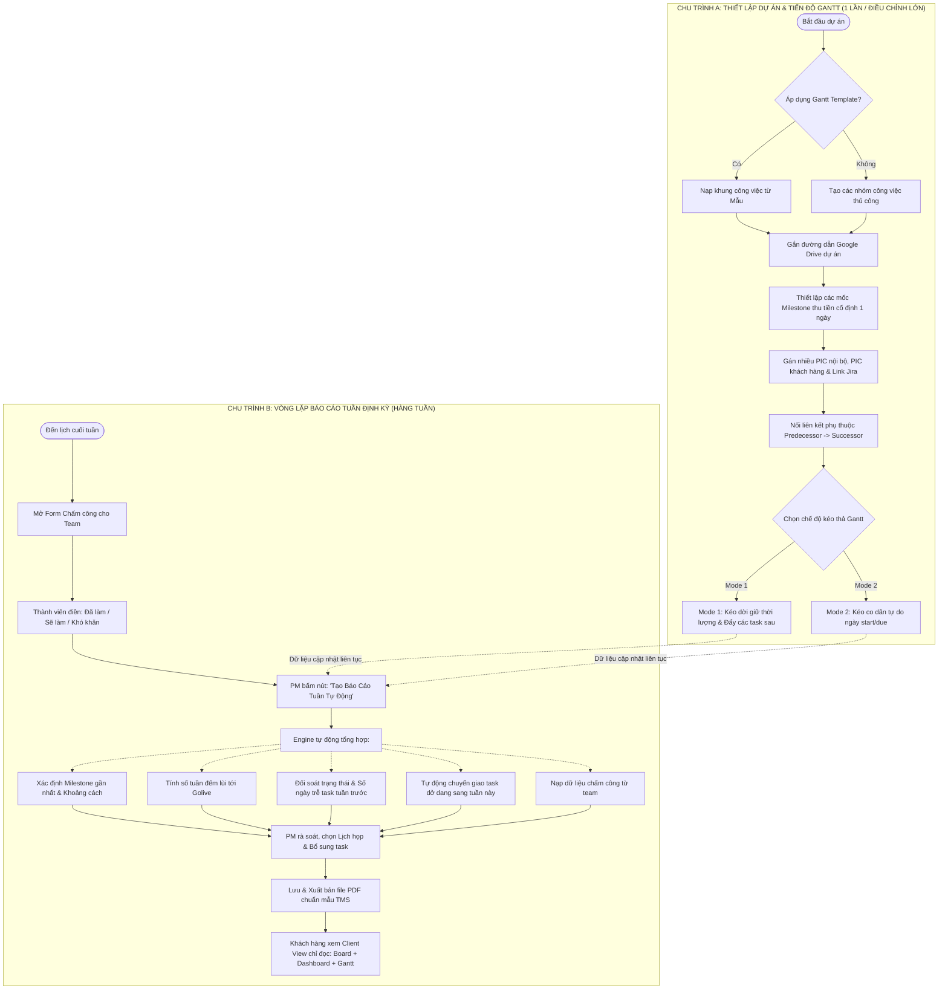
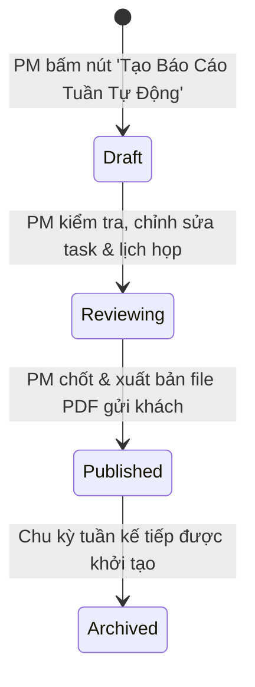

# [QT-01] Quy trình Quản lý Tiến độ Gantt, Cột mốc Milestone & Báo cáo Tuần Dự án

| Mục | Giá trị |
|-----|---------|
| Dự án | Trello Clone (B2B SaaS / Enterprise Project Management) |
| Phiên bản | 1.1 - 2026-09-24 |
| Người yêu cầu | Quản lý dự án (PM / Workspace Owner) |
| Ưu tiên | Gấp |
| Loại | Sửa tính năng có sẵn & Mở rộng chuyên sâu theo mẫu báo cáo thực tế |

## 1. Tóm tắt
Quy trình phân tách rành mạch thành 2 chu trình nghiệp vụ độc lập: (1) Chu trình Thiết lập & Điều phối Tiến độ dự án (khởi tạo từ mẫu Gantt, gắn link Google Drive, quản lý cột mốc Milestone thu tiền, liên kết phụ thuộc công việc và kéo thả Gantt 2 chế độ); (2) Chu trình Vòng lặp Báo cáo Tuần định kỳ thông qua nút bấm "Tạo Báo cáo Tuần Tự Động" (tự động đếm lùi số tuần tới Golive, xác định Milestone gần nhất, chuyển giao task tuần trước dở dang, tổng hợp biểu mẫu chấm công của team, đối soát PIC nội bộ & PIC khách hàng, ghi nhận lịch họp và xuất bản file PDF chuyên nghiệp theo mẫu dự án TMS).

## 2. Tác nhân & quyền
| Tác nhân | Vai trò hệ thống | Được làm gì trong quy trình |
|----------|-----------------|-----------------------------|
| Quản lý dự án (PM) | `ws_owner` / `ws_admin` | Thiết lập ban đầu cho dự án, gắn link Google Drive, tạo/sửa mốc Milestone thu tiền, cấu hình liên kết phụ thuộc task trên Gantt. Hàng tuần, bấm nút "Tạo Báo cáo Tuần Tự Động", gán nhiều PIC phụ trách (nội bộ & khách hàng), duyệt check-in của team, bổ sung lịch họp và xuất file PDF gửi khách. |
| Thành viên dự án (Dev/QA/BA) | `ws_member` | Xem Gantt chart, cập nhật tiến độ các task được phân công, hoàn thành biểu mẫu check-in/chấm công tuần trước hạn chót. |
| Khách hàng / Đối tác (Client) | `client` (hoặc `observer` qua Client Portal / Link bảo mật) | Truy cập Client View chỉ đọc: xem bảng Kanban, Dashboard chỉ số và Biểu đồ Gantt, xem báo cáo tuần được phát hành. Được chỉ định trong trường PIC Khách hàng (`client_pics`) trên các đầu việc phối hợp. |
| Lãnh đạo giám sát | `executive` / `super_admin` | Xem báo cáo tiến độ, mốc thu tiền và lịch sử báo cáo tuần của mọi dự án trên hệ thống. |

## 3. Điều kiện trước
- Dự án (Board) đã được tạo trong một Không gian làm việc (`workspaces`) hợp lệ.
- Danh sách thành viên nội bộ (`ws_member`) và người liên hệ phía khách hàng đã được cấu hình trong dự án.
- Mốc Golive và các mốc thanh toán Milestone đã có thông tin sơ bộ từ hợp đồng.

---

## 4. Luồng chính

Quy trình được chia thành 2 chu trình nghiệp vụ độc lập:

### Chu trình A: Thiết lập & Điều phối Tiến độ Dự án (Thực hiện khi bắt đầu dự án hoặc khi có điều chỉnh lớn)

| Bước | Ai | Hành động | Hệ thống xử lý | Kết quả người dùng thấy | Đã có / Mới |
|------|----|-----------|----------------|--------------------------|-------------|
| A1 | PM | Mở dự án và chọn "Nạp từ Gantt Template" hoặc tạo khung công việc mới | Kiểm tra quyền `ws_owner`, nạp danh sách công việc và thời lượng chuẩn từ mẫu có sẵn (`is_template = true`) | Toàn bộ các gói công việc chuẩn xuất hiện trên trục thời gian Gantt | Mới |
| A2 | PM | Nhập đường dẫn thư mục Google Drive tại ô "Google Drive Folder" trên thanh công cụ dự án | Kiểm tra cú pháp URL Google Drive hợp lệ, lưu vào trường `boards.google_drive_url` | Biểu tượng Google Drive hiển thị trực tiếp trên thanh công cụ dự án | Mới |
| A3 | PM | Chuyển sang tab Milestone, bấm "Thêm Milestone", nhập Tên mốc, Ngày ấn định thu tiền (`targetDate`), Số tiền dự kiến thu và Ghi chú | Lưu bản ghi vào bảng `milestones` với trạng thái `pending`, định dạng 1 ngày xác định (Single Target Date, không có khoảng start-end) | Cờ mốc Milestone (vàng/xanh) xuất hiện chính xác trên trục ngày của Gantt chart | Mới |
| A4 | PM | Tạo/Sửa thẻ công việc, gán **nhiều người phụ trách nội bộ (`internal_pics`)** và **người phụ trách phía khách hàng (`client_pics`)**, gắn link Jira (`jira_url`), điền Kết quả kỳ vọng (`expected_result`) | Cập nhật thông tin thẻ vào bảng `cards` và bảng phân công phụ trách `card_assignees` | Thẻ hiển thị avatar nhóm phụ trách, nhãn Jira và kết quả kỳ vọng | Mới |
| A5 | PM | Nối các mũi tên liên kết phụ thuộc (Predecessor -> Successor) giữa các task trên Gantt và chọn chế độ kéo thả | Ghi nhận quan hệ vào bảng `card_dependencies`. Kích hoạt bộ lắng nghe kéo thả theo 1 trong 2 chế độ (Mode 1: Cascade Push hoặc Mode 2: Flexible Stretch) | Mũi tên liên kết xuất hiện nối giữa các thanh công việc | Mới |
| A6 | PM | Thao tác kéo thả trực tiếp trên Gantt Chart | **Mode 1 (Cố định thời lượng)**: Dời ngày task A, hệ thống tự động đẩy tịnh tiến toàn bộ các task phụ thuộc nối sau mà không làm thay đổi số ngày làm việc; **Mode 2 (Co dãn tự do)**: Kéo mép thanh bar để đổi `startDate` hoặc `dueDate` độc lập | Toàn bộ thanh bar dịch chuyển mượt mà, ngày tháng tự động lưu vào database | Mới |

---

### Chu trình B: Vòng lặp Báo cáo Tuần Định kỳ & Chấm công (Thực hiện định kỳ hàng tuần)

| Bước | Ai | Hành động | Hệ thống xử lý | Kết quả người dùng thấy | Đã có / Mới |
|------|----|-----------|----------------|--------------------------|-------------|
| B1 | Hệ thống | Đến ngày hẹn định kỳ (thứ 5 hoặc thứ 6), tự động mở Biểu mẫu Check-in Tuần cho thành viên | Tạo bản ghi `member_weekly_checkins` cho tuần hiện tại, gửi thông báo in-app & email nhắc nhở toàn bộ `ws_member` | Thành viên nhận thông báo nhắc nộp báo cáo chấm công tuần | Mới |
| B2 | Thành viên | Mở biểu mẫu, điền 3 nội dung: (1) Tuần này đã làm gì? (2) Tuần tới sẽ làm gì? (3) Cần hỗ trợ/Khó khăn gì? và bấm Nộp | Lưu dữ liệu check-in, ghi nhận số giờ làm việc, cập nhật trạng thái `submitted` | Thông báo nộp thành công, phiếu hiển thị trạng thái "Đã nộp" | Mới |
| B3 | PM | Truy cập mục "Báo cáo Tuần" và bấm nút **"Tạo Báo cáo Tuần Tự Động"** | Hệ thống tự động kích hoạt tiến trình tạo báo cáo thông minh: <br>1. Tính số tuần thứ mấy trong năm (`week_number`) và khoảng ngày trong tuần.<br>2. Tìm cột mốc Milestone thu tiền gần nhất và khoảng cách ngày.<br>3. Tính số tuần đếm lùi còn lại tới ngày Golive dự án.<br>4. Quét danh sách task PM đã chọn tuần trước: đối soát trạng thái thực tế (`Done`/`Doing`/`Pending`), tính số ngày trễ tiến độ nếu có.<br>5. Tự động đưa các task dở dang tuần trước sang bảng kế hoạch tuần này mà không cần chọn lại.<br>6. Nạp nội dung khai báo của team từ biểu mẫu check-in. | Màn hình soạn thảo Báo cáo Tuần hiển thị với 80% dữ liệu đã được tính toán và điền sẵn chính xác | Mới |
| B4 | PM | Rà soát danh sách công việc tuần này, bổ sung thêm task mới (nếu cần), chọn lịch họp trong tuần (Meeting Calendar Picker), điền ghi chú rủi ro | Cập nhật các bảng liên kết `weekly_reports`, `weekly_report_tasks` và `weekly_meetings` | Giao diện hiển thị bảng công việc rõ ràng: Thời gian, Nội dung, Kết quả kỳ vọng, PIC nội bộ, PIC khách hàng, Tình trạng, Tiến độ | Mới |
| B5 | PM | Bấm "Lưu & Xuất Bản Báo Cáo", sau đó chọn "Tải file PDF / Xuất Slide" | Hệ thống chốt trạng thái `published`, gọi service kết xuất PDF chất lượng cao chuẩn bố cục dự án TMS (Roadmap tổng thể, Bảng công việc tuần qua, Kế hoạch tuần tới, Lịch họp & Rủi ro) | File PDF được tải về máy, đồng thời được lưu vào kho lưu trữ MinIO | Mới |
| B6 | Khách hàng | Mở đường link Client View (hoặc nhận báo cáo qua email) | Xác thực mã truy cập bảo mật, hiển thị giao diện Client Portal chỉ đọc | Khách hàng xem trực quan: Bảng Kanban tiến độ, Dashboard đếm ngược Golive, Biểu đồ Gantt và link tải PDF báo cáo tuần | Mới |

---

## 5. Sơ đồ



---

## 6. Luồng phụ & lỗi

| Mã | Tình huống | Hệ thống phản hồi | Thông báo cho người dùng |
|----|-----------|-------------------|--------------------------|
| E1 | Người dùng không phải PM (`ws_member`, `client`) bấm nút "Tạo Báo cáo Tuần Tự Động" hoặc sửa Milestone | Backend chặn bằng RBAC Guard (`403 Forbidden`) | "Bạn không có quyền thực hiện thao tác quản trị tiến độ hoặc lập báo cáo tuần." |
| E2 | Kéo thả task trên Gantt tạo ra chu trình khép kín (Vòng lặp phụ thuộc A -> B -> A) | Thuật toán Cycle Detection chặn thao tác ghi | "Không thể liên kết: Công việc này tạo ra vòng lặp phụ thuộc vô tận giữa các đầu việc." |
| E3 | Nhập sai định dạng URL Google Drive hoặc liên kết Jira | Regex validator từ chối cập nhật (`400 Bad Request`) | "Đường dẫn không hợp lệ. Vui lòng nhập đúng định dạng liên kết Google Drive hoặc Jira." |
| E4 | Dự án chưa thiết lập ngày Golive hoặc chưa có Milestone nào khi bấm nút tạo báo cáo tự động | Hệ thống cảnh báo nhẹ, gán giá trị mặc định "Chưa xác định" và cho phép PM nhập tay trực tiếp trên báo cáo | "Dự án chưa có mốc Golive/Milestone. Bạn có thể nhập bổ sung ngay trên báo cáo này." |
| E5 | Thành viên chưa nộp form chấm công tuần khi đến hạn PM chốt | Hệ thống đánh dấu trạng thái `missing`, cho phép PM gửi nhắc nhở 1-click hoặc tiếp tục lập báo cáo | "Có [X] thành viên chưa nộp báo cáo chấm công. Bạn có muốn gửi thông báo nhắc nhở?" |
| E6 | Khách hàng truy cập Client View bằng liên kết hết hạn hoặc sai Token | Trả về mã lỗi `401 Unauthorized` / `404 Not Found` | "Đường dẫn xem dự án không hợp lệ hoặc đã hết hạn truy cập. Vui lòng liên hệ PM dự án." |

---

## 7. Trạng thái (Vòng đời Báo cáo Tuần & Milestone)

### A. Vòng đời Báo cáo Tuần (`WeeklyReport`)


| Từ | Sang | Khi nào | Ai được làm |
|----|------|---------|-------------|
| [*] | Draft | PM bấm nút "Tạo Báo cáo Tuần Tự Động" | PM (`ws_owner`) |
| Draft | Reviewing | Đã hoàn tất đối soát số liệu và nạp form chấm công | PM (`ws_owner`) |
| Reviewing | Published | PM duyệt chốt báo cáo và bấm xuất file PDF | PM (`ws_owner`) |
| Published | Archived | Báo cáo tuần mới được tạo ra thay thế | Hệ thống |

### B. Vòng đời Cột mốc Milestone (`Milestone`)
| Từ | Sang | Khi nào | Ai được làm |
|----|------|---------|-------------|
| [*] | pending | Khởi tạo mốc nghiệm thu / đợt thu tiền | PM (`ws_owner`) |
| pending | achieved | Toàn bộ đầu việc gắn với Milestone đã nghiệm thu | PM (`ws_owner`) |
| pending | overdue | Quá ngày `targetDate` nhưng chưa hoàn thành | Hệ thống tự quét |
| achieved | paid | Khách hàng đã thanh toán đủ tiền đợt mốc | PM / Kế toán |

---

## 8. Quy tắc nghiệp vụ

| Mã | Quy tắc |
|----|---------|
| BR-01 | **Mốc Milestone là điểm mốc đơn nhất (Single Date)**: Cột mốc thu tiền chỉ có duy nhất trường `targetDate` (ngày cụ thể), không có khoảng thời gian bắt đầu - kết thúc, nhằm kiểm soát chặt chẽ nghĩa vụ thanh toán theo hợp đồng. |
| BR-02 | **Hỗ trợ Đa phụ trách (Multiple PICs)**: Mỗi công việc cho phép phân công đồng thời **nhiều PIC nội bộ (`internal_pics`)** và **nhiều PIC khách hàng (`client_pics`)**. Mọi PIC đều nhận được thông báo tiến độ và hiển thị rõ ràng trên báo cáo tuần. |
| BR-03 | **Cơ chế Kéo thả Gantt Mode 1 (Cascade Push - Cố định thời lượng)**: Khi kéo di chuyển một công việc có các công việc phụ thuộc nối sau, toàn bộ chuỗi công việc phụ thuộc sẽ tự động được tịnh tiến lùi/tiến theo đúng độ lệch ngày, giữ nguyên số ngày thực hiện (`duration`) của từng công việc. |
| BR-04 | **Cơ chế Kéo thả Gantt Mode 2 (Flexible Stretch - Co dãn thời lượng)**: Khi kéo mép trái/phải của thanh bar, chỉ thay đổi ngày bắt đầu hoặc ngày kết thúc của chính công việc đó, không làm dịch chuyển các công việc khác trừ khi có cảnh báo vi phạm phụ thuộc. |
| BR-05 | **Quy tắc Nút "Tạo Báo Cáo Tuần Tự Động" (Auto Generation Engine)**: Bấm 1 chạm sẽ tự động: (a) Tính số tuần trong năm; (b) Tính khoảng cách tới Milestone gần nhất; (c) Đếm lùi số tuần tới Golive; (d) Kéo toàn bộ task tuần trước sang đánh giá `Done`/`Doing`/`Pending` kèm số ngày trễ hạn; (e) Tự động chuyển giao (Rollover) các task chưa xong sang tuần mới mà không cần chọn lại; (f) Tổng hợp phiếu chấm công của team. |
| BR-06 | **Cấu trúc Bảng Báo Cáo Tuần Chuẩn (Theo mẫu TMS Project)**: Bảng công việc bắt buộc gồm 7 cột: `Thời gian`, `Nội dung`, `Kết quả kỳ vọng`, `Nhà thầu PIC (Smartlog PIC)`, `Khách hàng PIC (Foodlog PIC)`, `Tình trạng`, `Tiến độ (Đúng tiến độ / Trễ X ngày)`. |
| BR-07 | **Bảo mật tuyệt đối cho Client View**: Khách hàng khi xem qua Client Portal chỉ xem dữ liệu (Read-only); hệ thống ẩn hoàn toàn dữ liệu chấm công nội bộ, số tiền thu chi nội bộ và các trao đổi riêng tư của đội ngũ phát triển. |

---

## 9. Thông báo, realtime & nhật ký

| Sự kiện | Ai nhận | Kênh | Nội dung | Ghi audit? |
|---------|---------|------|----------|:----------:|
| PM điều chỉnh tiến độ hoặc dịch chuyển hàng loạt trên Gantt | Tất cả PIC của các task bị ảnh hưởng | In-app notification + WebSocket | "Kế hoạch thời gian của công việc [Tên task] vừa được điều chỉnh trên Gantt." | Có (`access_audit`) |
| Mở form chấm công tuần định kỳ | Toàn bộ thành viên `ws_member` | In-app notification + Email | "Đã mở phiếu chấm công & báo cáo tiến độ tuần [Số tuần]. Vui lòng nộp trước 17h thứ 6." | Không |
| Thành viên nộp form chấm công | PM (`ws_owner`) | In-app notification | "Thành viên [Tên] đã nộp báo cáo chấm công tuần [Số tuần]." | Có |
| Bấm nút Tạo Báo cáo Tuần & Xuất bản PDF | PM, Ban giám đốc (`executive`), Khách hàng | In-app notification + Email đính kèm PDF | "Báo cáo tuần [Số tuần] của dự án [Tên Board] đã được xuất bản." | Có (`access_audit`) |

---

## 10. Dữ liệu

| Thông tin | Bắt buộc | Ràng buộc | Ví dụ |
|-----------|----------|-----------|-------|
| `boards.google_drive_url` | Không | URL hợp lệ domain Google Drive | `https://drive.google.com/drive/folders/1xyz...` |
| `boards.golive_date` | Không | Ngày hợp lệ (`YYYY-MM-DD`) | `2026-11-15` |
| `milestones.title` | Có | Tối đa 255 ký tự | `Nghiệm thu Giai đoạn 1 & Thu 30% HĐ` |
| `milestones.target_date` | Có | Ngày hợp lệ (`YYYY-MM-DD`) | `2026-10-15` |
| `milestones.payment_amount` | Không | Số tiền dương (Decimal) | `100,000,000 VND` |
| `card_assignees` | Không | Cặp `(card_id, user_id, assignee_type)` với type: 'internal' hoặc 'client' | `Mr. Dũng, Mr. Tín (internal); Ms. Tố (client)` |
| `cards.jira_url` | Không | URL hợp lệ | `https://jira.company.com/browse/TMS-102` |
| `cards.expected_result` | Không | Văn bản mô tả kết quả kỳ vọng | `Hoàn tất tích hợp 100% bug và test round 1` |
| `card_dependencies` | Có (khi nối) | Cặp `(predecessor_id, successor_id, type)` | `(Task A -> Task B, type: 'FS')` |
| `weekly_reports.week_number` | Có | Số nguyên 1 - 53 | `23` |
| `weekly_reports.near_milestone_id`| Không | Khóa ngoại trỏ đến `milestones.id` | ID Milestone Phase 1 |
| `weekly_reports.weeks_to_golive` | Không | Số thập phân | `5.5 tuần` |
| `weekly_reports.weekly_meetings` | Không | Mảng JSON chứa ngày họp, nội dung, người tham gia | `[{"date": "2026-06-28", "topic": "Review phân quyền", "attendees": "Mr. Sơn, Ms. Tố"}]` |
| `weekly_report_tasks.progress_evaluation` | Không | Text đánh giá tiến độ | `Trễ tiến độ 10 ngày phần GS theo ngày 17/06` |
| `member_weekly_checkins` | Có | 3 trường: Đã làm gì, Sẽ làm gì, Cần hỗ trợ gì | Text mô tả nội dung tự khai |

---

## 11. Màn hình liên quan
- **Thanh công cụ Dự án (Board Header Toolbar)**: Bổ sung ô nhập link Google Drive, nút chọn Gantt Template, nút chuyển chế độ xem (Kanban / Gantt / Milestone / Báo cáo tuần).
- **Màn hình Gantt Chart Trực quan**: Chuyển đổi Mode 1 / Mode 2 kéo thả, vẽ đường phụ thuộc mũi tên, hiển thị cờ Milestone thanh toán.
- **Màn hình Báo cáo Tuần (Dành cho PM)**:
  - Nút bấm nổi bật: **"⚡ Tạo Báo Cáo Tuần Tự Động"**.
  - Khối chỉ số: Milestone thu tiền gần nhất, số tuần còn lại tới Golive.
  - Bảng công việc 7 cột chuẩn mẫu TMS: Công việc tuần qua và Kế hoạch tuần tới.
  - Lịch chọn cuộc họp trong tuần (Meeting Calendar Picker) và danh mục rủi ro/phát sinh ngoài.
  - Nút bấm: "Lưu báo cáo" và "Tải file PDF / Xuất Slide".
- **Biểu mẫu Chấm công Tuần (Dành cho Dev/QA/BA)**: Giao diện form ngắn gọn, thân thiện trên mobile/desktop để nhân viên check-in thứ Sáu hàng tuần.
- **Màn hình Client Portal (Chế độ xem cho Khách hàng)**: Giao diện chỉ đọc, bảo mật, gồm 3 tab: Bảng Kanban, Dashboard chỉ số & Biểu đồ Gantt.

---

## 12. Tiêu chí nghiệm thu
- **AC-01 (Nút Tạo Báo cáo Tuần Tự Động)**: Cho PM trong dự án / Khi bấm nút "Tạo Báo Cáo Tuần Tự Động" / Thì hệ thống tự động sinh kỳ báo cáo tuần mới, tự tính số tuần tới Golive, xác định mốc Milestone gần nhất, chuyển toàn bộ task dở dang tuần trước sang tuần này và tổng hợp phiếu chấm công của team mà không cần nhập tay lại từ đầu.
- **AC-02 (Cột mốc Milestone ngày xác định)**: Cho PM / Khi tạo Milestone với 1 ngày ấn định / Thì Milestone lưu trữ với `target_date`, không yêu cầu khoảng thời gian, và hiển thị đúng ngày đó trên trục thời gian Gantt.
- **AC-03 (Kéo thả Gantt Mode 1 - Tự động đẩy task phụ thuộc)**: Cho 2 task A và B có liên kết A -> B / Khi PM chọn Chế độ 1 và dời ngày task A thêm 4 ngày / Thì task B tự động dời lùi 4 ngày và thời lượng (Duration) của B không bị co ngắn.
- **AC-04 (Kéo thả Gantt Mode 2 - Co dãn linh hoạt)**: Cho PM chọn Chế độ 2 / Khi kéo mép phải của thanh bar task A từ 3 ngày thành 6 ngày / Thì `dueDate` của task A cập nhật thành 6 ngày và không làm đẩy dịch chuyển vị trí task B.
- **AC-05 (Đa người phụ trách & PIC khách hàng)**: Cho PM khi mở thẻ công việc / Khi gán nhiều PIC nội bộ (Smartlog PIC) và PIC khách hàng (Foodlog PIC) / Thì hệ thống lưu đầy đủ danh sách và thể hiện rõ ràng trên bảng báo cáo tuần.
- **AC-06 (Xuất file PDF chuẩn mẫu TMS)**: Cho PM / Khi nhấn "Tải file PDF" trên báo cáo tuần / Thì hệ thống kết xuất file PDF chứa đầy đủ: Bìa báo cáo, Roadmap tổng thể, Bảng công việc tuần qua, Bảng kế hoạch tuần tới, Lịch họp và Tình trạng tiến độ chi tiết.
- **AC-07 (Bảo vệ an toàn Client View)**: Cho Khách hàng truy cập Client Portal / Khi cố gắng kéo thả task, đổi ngày hoặc gọi API chỉnh sửa / Thì giao diện khóa toàn bộ thao tác sửa và server trả về lỗi `403 Forbidden`.

---

## 13. Ảnh hưởng tới phần có sẵn
- **Bảng `boards`**: Thêm trường `google_drive_url` (VARCHAR) và `golive_date` (DATE).
- **Bảng `cards`**: Thêm trường `jira_url` (VARCHAR), `expected_result` (TEXT). Bổ sung quan hệ đa phụ trách `card_assignees` thay thế cho sự ngang hàng hạn chế của `card_members`.
- **Giao diện `BoardView.jsx`**: Tích hợp thêm các tab `Gantt`, `Milestone`, `Weekly Report` bên cạnh `Kanban` và `Calendar`.
- **Routing**: Thêm tuyến đường công khai an toàn `/portal/:shareToken` cho Client View.

---

## 14. Giả định & câu hỏi mở

| Mã | Nội dung | Cần ai trả lời |
|----|----------|----------------|
| GD-01 | File mẫu PowerPoint `W23 - 27_06_22 - Weekly Report _TMS Project.pptx` tại `docs/` đã được giải mã và phân tích toàn bộ cấu trúc: gồm Bìa, Lộ trình Phase 1, Bảng việc tuần 23, Kế hoạch tuần 24, Bảng chuyên đề Tích hợp / Auto Planning với đầy đủ các cột (Thời gian, Nội dung, Kết quả kỳ vọng, Smartlog PIC, Foodlog PIC, Tình trạng, Tiến độ). Bản đặc tả này đã chuẩn hóa 100% theo mẫu thực tế này. | Đã xác nhận qua file mẫu |
| GD-02 | Mỗi công việc cho phép gán nhiều PIC nội bộ và nhiều PIC khách hàng như thể hiện trên các slide của file mẫu thực tế. | Đã xác nhận bởi người yêu cầu |
| GD-03 | Định dạng file xuất báo cáo mặc định là PDF chất lượng cao (kết xuất từ layout slide/báo cáo tương tự file mẫu PPTX) để PM gửi trực tiếp cho khách hàng. | Đã xác nhận |

---

## 15. Ghi chú kỹ thuật cho dev
- **Cơ sở dữ liệu (Prisma Schema Updates)**:
  - Tham chiếu file gốc: [schema.prisma](file:///c:/Users/jackn/spyder/Class-Trello-Clone/Trello-Clone-Backend/prisma/schema.prisma).
  - Cần bổ sung các model và trường:
    ```prisma
    // Bổ sung vào model Board
    model Board {
      // ... các trường hiện tại
      googleDriveUrl String?   @map("google_drive_url")
      goliveDate     DateTime? @map("golive_date") @db.Date
      milestones     Milestone[]
      weeklyReports  WeeklyReport[]
      checkins       MemberWeeklyCheckin[]
    }

    // Bổ sung vào model Card
    model Card {
      // ... các trường hiện tại
      jiraUrl        String?          @map("jira_url")
      expectedResult String?          @map("expected_result")
      assignees      CardAssignee[]
      dependenciesAsPredecessor CardDependency[] @relation("PredecessorCard")
      dependenciesAsSuccessor   CardDependency[] @relation("SuccessorCard")
    }

    model CardAssignee {
      id           String   @id @default(uuid()) @db.Uuid
      cardId       String   @map("card_id") @db.Uuid
      userId       String?  @map("user_id") @db.Uuid // null nếu là tên khách ngoài hệ thống
      externalName String?  @map("external_name") // Tên hiển thị (ví dụ: Ms. Tố, Mr. Khánh)
      assigneeType String   @default("internal") @map("assignee_type") // 'internal' | 'client'
      
      card Card  @relation(fields: [cardId], references: [id], onDelete: Cascade)
      user User? @relation(fields: [userId], references: [id], onDelete: Cascade)
      @@map("card_assignees")
    }

    model Milestone {
      id            String    @id @default(uuid()) @db.Uuid
      boardId       String    @map("board_id") @db.Uuid
      title         String
      targetDate    DateTime  @map("target_date") @db.Date
      paymentAmount Decimal?  @map("payment_amount") @db.Decimal(15, 2)
      isPaid        Boolean   @default(false) @map("is_paid")
      status        String    @default("pending") // pending | achieved | overdue | paid
      description   String?
      createdAt     DateTime  @default(now()) @map("created_at") @db.Timestamptz(6)
      board         Board     @relation(fields: [boardId], references: [id], onDelete: Cascade)
      @@map("milestones")
    }

    model CardDependency {
      id            String @id @default(uuid()) @db.Uuid
      predecessorId String @map("predecessor_id") @db.Uuid
      successorId   String @map("successor_id") @db.Uuid
      type          String @default("FS") // Finish-to-Start (FS), Start-to-Start (SS)
      predecessor   Card   @relation("PredecessorCard", fields: [predecessorId], references: [id], onDelete: Cascade)
      successor     Card   @relation("SuccessorCard", fields: [successorId], references: [id], onDelete: Cascade)
      @@unique([predecessorId, successorId])
      @@map("card_dependencies")
    }

    model WeeklyReport {
      id              String   @id @default(uuid()) @db.Uuid
      boardId         String   @map("board_id") @db.Uuid
      weekNumber      Int      @map("week_number")
      year            Int
      startDate       DateTime @map("start_date") @db.Date
      endDate         DateTime @map("end_date") @db.Date
      nearMilestoneId String?  @map("near_milestone_id") @db.Uuid
      weeksToGolive   Decimal? @map("weeks_to_golive") @db.Decimal(5, 1)
      meetings        Json?    // Danh sách cuộc họp trong tuần
      pdfUrl          String?  @map("pdf_url")
      status          String   @default("draft") // draft | published
      createdById     String   @map("created_by_id") @db.Uuid
      createdAt       DateTime @default(now()) @map("created_at") @db.Timestamptz(6)
      board           Board    @relation(fields: [boardId], references: [id], onDelete: Cascade)
      tasks           WeeklyReportTask[]
      @@map("weekly_reports")
    }

    model WeeklyReportTask {
      id                 String  @id @default(uuid()) @db.Uuid
      reportId           String  @map("report_id") @db.Uuid
      cardId             String  @map("card_id") @db.Uuid
      scopeType          String  @map("scope_type") // 'last_week' | 'this_week' | 'special_module'
      moduleName         String? @map("module_name") // ví dụ: 'INTEGRATION', 'AUTO PLANNING'
      expectedResult     String? @map("expected_result")
      internalPicsText   String? @map("internal_pics_text")
      clientPicsText     String? @map("client_pics_text")
      statusText         String? @map("status_text") // Done, Doing, Pending, Cancel
      progressEvaluation String? @map("progress_evaluation") // Đúng tiến độ, Trễ X ngày...
      isCarriedOver      Boolean @default(false) @map("is_carried_over")
      report             WeeklyReport @relation(fields: [reportId], references: [id], onDelete: Cascade)
      card               Card         @relation(fields: [cardId], references: [id], onDelete: Cascade)
      @@map("weekly_report_tasks")
    }

    model MemberWeeklyCheckin {
      id          String   @id @default(uuid()) @db.Uuid
      boardId     String   @map("board_id") @db.Uuid
      userId      String   @map("user_id") @db.Uuid
      weekNumber  Int      @map("week_number")
      year        Int
      doneText    String   @map("done_text")
      planText    String   @map("plan_text")
      blockerText String?  @map("blocker_text")
      hoursWorked Decimal? @map("hours_worked") @db.Decimal(5, 1)
      status      String   @default("submitted") // draft | submitted
      createdAt   DateTime @default(now()) @map("created_at") @db.Timestamptz(6)
      board       Board    @relation(fields: [boardId], references: [id], onDelete: Cascade)
      user        User     @relation(fields: [userId], references: [id], onDelete: Cascade)
      @@unique([boardId, userId, weekNumber, year])
      @@map("member_weekly_checkins")
    }
    ```
- **File tham chiếu liên quan**:
  - Giao diện người dùng: [BoardView.jsx](file:///c:/Users/jackn/spyder/Class-Trello-Clone/Trello-Clone-Frontend/apps/user/src/pages/BoardView.jsx)
  - Hệ thống định tuyến: [App.jsx](file:///c:/Users/jackn/spyder/Class-Trello-Clone/Trello-Clone-Frontend/apps/user/src/App.jsx)
  - Cấu trúc phân quyền: [CAU_TRUC_PHAN_QUYEN_RBAC_B2B.txt:L80-L135](file:///c:/Users/jackn/spyder/Class-Trello-Clone/CAU_TRUC_PHAN_QUYEN_RBAC_B2B.txt#L80-L135)

---

## Lịch sử thay đổi
| Phiên bản | Ngày | Thay đổi |
|-----------|------|----------|
| 1.0 | 2026-09-24 | Tạo mới đặc tả quy trình quản lý tiến độ Gantt, Milestone và Báo cáo tuần theo yêu cầu nghiệp vụ ban đầu. |
| 1.1 | 2026-09-24 | Cập nhật cấu trúc báo cáo tuần chuẩn hóa theo file thực tế `W23 - 27_06_22 - Weekly Report _TMS Project.pptx` (tách PIC nội bộ / PIC khách hàng, kết quả kỳ vọng, đánh giá trễ hạn); phân tách 2 chu trình độc lập (Thiết lập dự án vs Vòng lặp tuần); bổ sung nút bấm "Tạo Báo Cáo Tuần Tự Động" và cơ chế đa phụ trách. |
